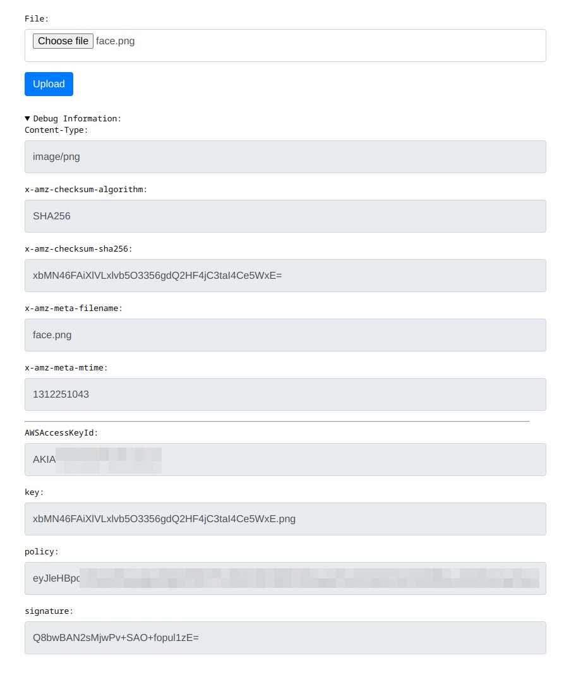

# bucket3

**bucket3** is a basic image hosting service that allows [browser-based uploads to Amazon S3](https://docs.aws.amazon.com/AmazonS3/latest/API/sigv4-UsingHTTPPOST.html).

The S3 object key is derived from the SHA-256 digest of the file and is guaranteed to be unique.

The service is dead-simple with no database and no built-in authentication. It is not recommended to expose the service to the general public without any authentication layer.



## Prerequisites

- Create an S3 bucket `example-bucket`.
- Put a domain `example.org` in front of the bucket (e.g. [with CloudFront](https://repost.aws/knowledge-center/cloudfront-serve-static-website)) so that `https://example.org/foo.png` returns `foo.png` in the bucket.

## Setup

```bash
# Install the package
pipx install git+https://github.com/wzyboy/bucket3

# Configure the web server
export BUCKET3_DOMAIN=example.org
export BUCKET3_BUCKET=example-bucket

# Configure AWS credentials if needed
# https://boto3.amazonaws.com/v1/documentation/api/latest/guide/credentials.html
#export AWS_ACCESS_KEY_ID=AKIA...
#export AWS_SECRET_ACCESS_KEY=...

# Start the web server (localhost:5333)
bucket3-web
```

## Special Thanks

Most of the frontend code is written by ChatGPT.
